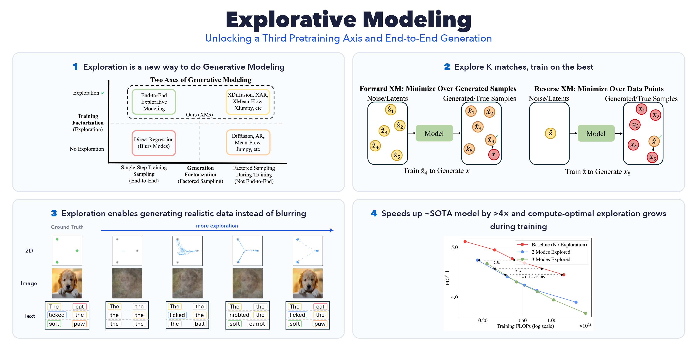

# 🔭 Explorative Modeling: Unlocking a Third Pretraining Axis and End-to-End Generation

📚 [Paper](https://arxiv.org/abs/2607.27372) | 🌐 [Website](https://explorative-modeling.github.io/) | 📝 [Blog](https://alexiglad.github.io/blog/2026/explorative_modeling/) | 🚀 [Getting Started with XMs](#getting-started-with-xms) | 🧾 [Bibtex](#citation)



We introduce **Explorative Modeling**, a new paradigm for generative modeling that acts as a **third pretraining axis** when added to existing generative models, and also enables **end-to-end** generation. Explorative Models (XMs) work by exploring K candidate matches between what the model generates and the data at each training step, and training on the best one.


## Setup

```bash
git clone https://github.com/alexiglad/XM.git
cd XM
```

Create the environment with Conda (recommended):

```bash
conda create -n xm python=3.12
conda activate xm
pip install -r requirements.txt
```

Then:

- Set `$HF_HOME` so datasets/models cache where you want, and `$HF_TOKEN` (ImageNet requires an accepted license).
- [Log in](https://docs.wandb.ai/ref/cli/wandb-login) to Weights & Biases with `wandb login`, and set `--wandb_entity` / `--wandb_project` in the job scripts.
- For video datasets (Something-Something V2, Kinetics-400) and `ffprobe`, see [data/vid/README.md](data/vid/README.md).


## Quick Start

Run any job script directly:

```bash
bash job_scripts/img/pretrain_class_conditional/xdit.sh
```

Or submit the same script to Slurm, which prepends a cluster header before `sbatch`:

```bash
bash slurm_executor.sh example_h100 job_scripts/img/pretrain_class_conditional/xdit.sh
```

The header lives in [job_scripts/slurm_headers/example_h100.slurm](job_scripts/slurm_headers/example_h100.slurm) — *fill in the `TODO`s for your cluster*. To add your own, drop a new `.slurm` file in that folder and add its name to `VALID_HEADERS` in [slurm_executor.sh](slurm_executor.sh).


## Getting Started with XMs

At each training step, XMs explore K possible matches between generations and data, and train only on the best match, so each prediction commits to a single mode rather than averaging across many. The pseudocode below shows **Forward XM**, which holds the data target fixed and explores over the model's own generations; **Reverse XM** flips this, holding a generation fixed and searching over K data targets (Sections 3.2 and A of the [paper](https://arxiv.org/abs/2607.27372)).

**Before Exploration**

```python
y    = model(sample_latent())   # generate one output (from noise, a mask, …)
loss = recon_loss(y, x)         # score it against the data target x
loss.backward()
```

**After Exploration** · explore K generations, keep the best (Forward XM)

```python
losses = []
for _ in range(K):                   # explore K candidate outputs
    y = model(sample_latent())       # generate one candidate
    losses.append(recon_loss(y, x))  # score each against x

min(losses).backward()               # train only the closest candidate
```

**Example: Adding Exploration to a Diffusion / Flow Model**

```python
t = sample_timestep()
losses = []
for _ in range(K):                          # explore K candidate noises
    z    = randn_like(x)                    # one candidate noise
    x_t  = add_noise(x, z, t)               # noise the data to level t
    losses.append(diffusion_loss(model(x_t, t), x, z))

min(losses).backward()                      # train only the closest candidate
```

XMs combine with existing generative models very simply: explore over the latent variable (here, the noise) and backpropagate only through the best candidate. In this repo, exploration is just `--xm_best_of_k K`, and `K = 1` is a model with no exploration (the baseline model).


## Job Scripts

All experiments are launched from `job_scripts/<modality>/`:

| Script | What it trains |
| --- | --- |
| `img/pretrain_class_conditional/xdit.sh` | XDiffusion (DiT + exploration), class-conditional ImageNet 256×256 |
| `img/pretrain_class_conditional/xjumpy.sh` | XJumpy, same setup |
| `vid/pretrain_wm/xdit_128.sh` | XDiffusion goal-conditioned video world model, 128×128 SSv2 |
| `vid/pretrain_wm/xjumpy_128.sh` | XJumpy, same setup |

FID and FVD are evaluated online between training epochs via `--run_online_evaluation`.


## Repo Structure

```
├── abbreviations.md              # abbreviations used across the repo
├── base_model_trainer.py         # PyTorch Lightning module: training/val/test loops, data setup, logging
├── data
│   ├── img                       # ImageNet + synthetic image dataloaders
│   ├── nlp                       # FineWeb and evaluation dataloaders
│   └── vid                       # SSv2/Kinetics dataloaders, preencoding (see its README)
├── inference
│   ├── img                       # online FID evaluation
│   ├── nlp                       # online LM harness evaluation
│   └── vid                       # online FVD evaluation
├── job_scripts                   # all training scripts, by modality, plus Slurm headers
├── model
│   ├── diffusion                 # diffusion utilities (from the DiT repo)
│   ├── diffusion_transformer.py  # DiT backbone
│   ├── flow                      # flow matching, schedulers, OT coupling
│   ├── img                       # class-conditional image models
│   ├── jumpy.py                  # Jumpy generative model
│   ├── model_utils.py            # shared model code, encoders, model sizes
│   ├── nlp                       # autoregressive and masked diffusion language models
│   ├── vid                       # video world models
│   └── video_transformer_3d.py   # 3D transformer backbone for video
├── optimization.py               # LR schedulers and optimizer helpers
├── slurm_executor.sh             # combines a Slurm header with a job script and submits it
├── train_model.py                # entry point: argparse, distributed setup, Lightning trainer
└── utils                         # latent caching, metrics, dataloader debugging, RAE
```

Abbreviations used throughout the code are listed in [abbreviations.md](abbreviations.md).


## Coming Soon

- **The RAE results** do not use this repo---those runs add exploration to the [RAE codebase](https://github.com/bytetriper/RAE), which we will release separately soon.
- Code for **masked diffusion language models (MDLMs)** and the **control tasks** (Explorative Policy and Explorative World Model) will be open sourced soon as well.


## Citation

If you find this repository useful, please consider giving a star ⭐ and citation 🙃:

```bibtex
@misc{gladstone2026explorativemodelingunlockingpretraining,
      title={Explorative Modeling: Unlocking a Third Pretraining Axis and End-to-End Generation}, 
      author={Alexi Gladstone and Heng Ji and Yilun Du},
      year={2026},
      eprint={2607.27372},
      archivePrefix={arXiv},
      primaryClass={cs.LG},
      url={https://arxiv.org/abs/2607.27372}, 
}
```


## Contact

If you have questions feel free to post them on GitHub issues or email me ([alexigladstone@gmail.com](mailto:alexigladstone@gmail.com)). Enjoy!
